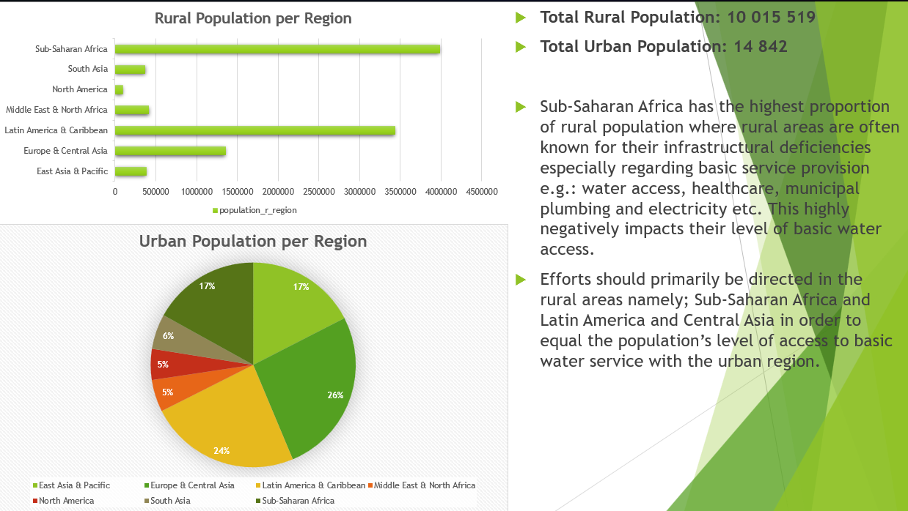

# Maji Ndogo Project - Access to Drinking Water: Data Cleaning, Transformation and Analysis.

**[👉 Click here to view the Full Presentation (PDF)](https://github.com/silomo-luthando-kunene/alx-data_analysis_project-/blob/88be3d68cf33ec3d7fa71a2c4c1e37d404f8480b/%5B1%5D%20Preparing%20Data/Preparing%20Data%20Presentation.pdf)**

## Project Overview
This project investigates progress made towards global access to safe and affordable drinking water, aligned with the **UN Sustainable Development Goal 6 (Clean Water & Sanitation)**. Utilizing WHO/UNICEF data from the Joint Monitoring Programme (JMP), the analysis focuses on the **Annual Rate of Change (ARC)** to determine which regions are successfully scaling water access and which require urgent policy intervention.

The primary objective was to transform raw monitoring data into actionable insights by calculating Annual Rates of Change (ARC) and identifying trends in service accessibility based on geographical regions.

## Data Engineering & Transformation
A significant portion of this project focused on rigorous data cleaning and feature engineering to ensure analytical accuracy:
* **Data Integrity:** Identified and resolved delimiter inconsistencies (semicolon vs. comma) and managed missing values (`NaN`) to ensure longitudinal accuracy.
* **Feature Engineering:** Synthesized absolute population metrics from percentage shares for demographic weighting.
  * Developed the **ARC (Annual Rate of Change)** logic to measure the velocity of infrastructure development.
  * Created pop_u_val to convert percentage shares into absolute population figures for global comparison.
  * Calculated y_diff to determine the interval between data collections per country.
* **Annual Rate of Change (ARC) Calculation:** Implemented conditional logic to calculate the yearly change rate in water access for national, rural, and urban sectors.
  * **Formula:** ARC_x = (P_x,y2 - P_x,y1) / (Y_2 - Y_1).

## Key Analytical Insights
* **Priority Regions:** Identified Sub-Saharan Africa, Central Asia, and Latin America as the highest-priority regions for targeted water service investment.
* **Quality Audit:** Validated the sample against a global population of 7.82B to ensure regional representations were statistically significant.
* **Urban-Rural Disparity:** Urban regions have a significantly lower annual rate of change metric illustrating the infrastructurally developed nature of the regions justifying an intensive program into increasing the share of access to basic water services in rural regions.
* **The Rural Bottleneck:** While global ARC is positive, rural Sub-Saharan Africa remains a critical infrastructure bottleneck caused by the high number of rural and urban population and the underdeveloped setting of the rural landscape.

### Estimates of the use of water (2000-2020): 
Estimates of the use of water (2000-2020).csv: The primary longitudinal dataset used for ARC calculations.
