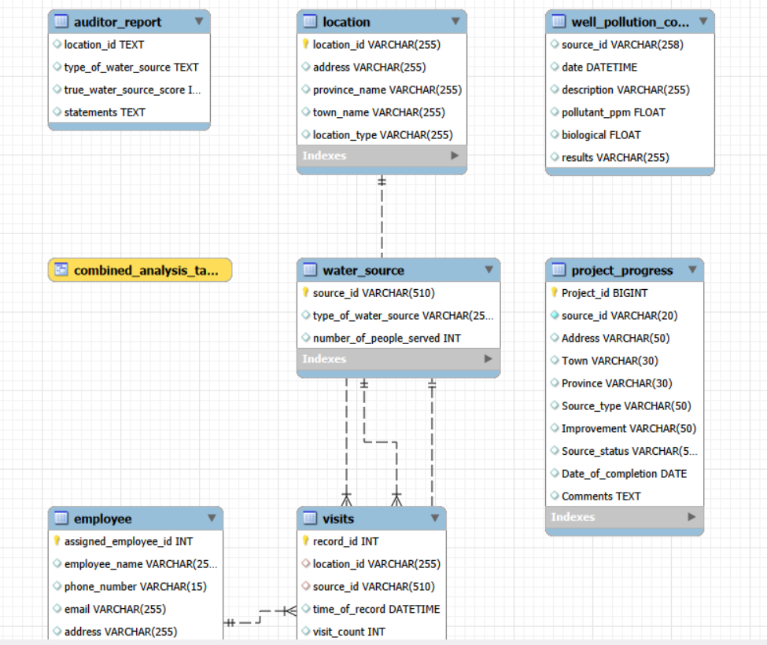
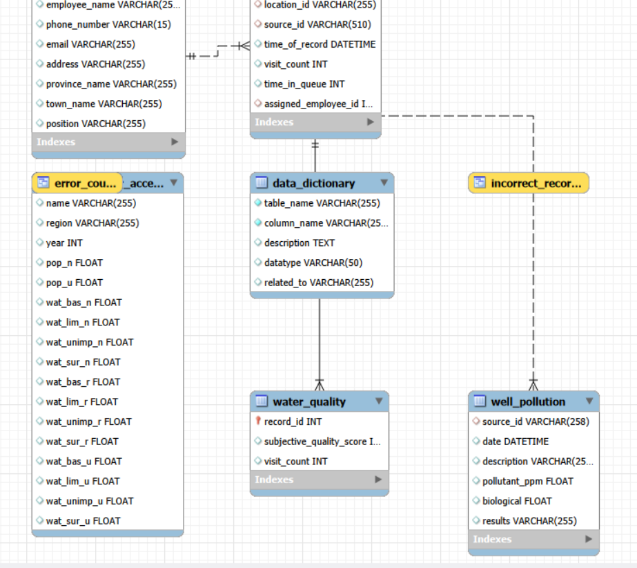
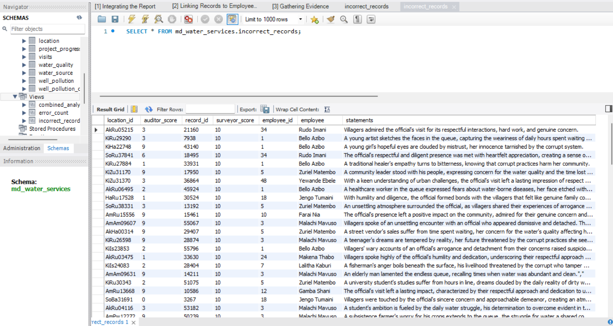

# Maji Ndogo Part 2: SQL-Driven Analysis & Operational Strategy

## 🎯 Project Scope
In this phase, the analysis transitioned into the **Maji Ndogo Relational Database**. The objective was to handle a large-scale dataset (60,000+ records) to audit data integrity, identify specific infrastructure failures, and generate a data-backed deployment plan for engineering teams.

## 🛠️ Technical Stack
* **Language:** SQL (MySQL)
* **Concepts:** CTEs, Window Functions, Data Auditing, Relational Mapping, CASE logic.

## ⚙️ Technical Implementation
I utilized advanced SQL techniques to join disparate data threads (surveys, auditor reports, and water source stats) into a single source of truth for the Maji Ndogo government.

* **Database Auditing:** Cross-referenced 60,000 field records against independent audits to identify anomalies and ensure data reliability.
* **Operational Metrics:** Calculated wait-time benchmarks (Queue Analysis) to identify sites failing UN standards.
* **Complex Data Modeling:** Utilized **CTEs (Common Table Expressions)** and **Window Functions** to rank sources by priority and population served.

### 🗺️ Database Architecture (ERD)
 

## 📊 Key Metrics & Discoveries
This analysis moved beyond visual trends into hard operational numbers:

* **Systemic Integrity Audit:** Identified **4 specific field officials** whose records consistently deviated from audit scores. A targeted SQL analysis revealed a 100% correlation between these discrepancies and mentions of "cash" payments, flagging potential systemic corruption.
* **Queue Time Optimization:** Analysis of the `visits` table revealed that specific "Shared Taps" peaked at over **30 minutes**, identifying a critical need for localized infrastructure expansion.
* **The "Backlog" Metric:** Successfully synthesized and mapped **25,398 specific interventions** (e.g., UV Filter installations, RO Systems, and new Well drills).
* **Project Management:** Engineered a `Project_progress` system to transition "Backlog" items into actionable "Job Lists" for field engineering teams.

## 🏗️ The Engineering Roadmap (Work Order Generation)
The final output was a **Project Implementation Table** designed for field engineering teams to track progress.

| Source Type | Identified Issue | Data-Driven Recommendation | Status |
| :--- | :--- | :--- | :--- |
| **Polluted Wells** | Biological/Chemical Contamination | Install UV/RO Filters | Backlog |
| **Shared Taps** | Wait Times > 30 Mins | Install Additional Taps (Queue Ratio) | Backlog |
| **Broken Taps** | Infrastructure Failure | Localized Diagnostic & Repair | Backlog |
| **Rivers** | Unprotected Source | Drill New Well / Establish Infrastructure | Backlog |

## 💻 Technical Logic Sample: Retrieving data

<a href="./thumbnail3.png">
  
</a>

```sql
-- Linking auditor performance records to employees using the employee_id column
SELECT
    auditor_report.location_id AS location_id,
    auditor_report.true_water_source_score AS auditor_score,
	visits.record_id,
    water_quality.subjective_quality_score AS surveyor_score,
	visits.assigned_employee_id AS employee_id,
	employee.employee_name AS employee
    
FROM
    auditor_report

JOIN visits ON auditor_report.location_id = visits.location_id
JOIN water_quality ON visits.record_id = water_quality.record_id
JOIN employee ON visits.assigned_employee_id = employee.assigned_employee_id

WHERE 
	auditor_report.true_water_source_score <> water_quality.subjective_quality_score AND
	visits.visit_count = 1

LIMIT 10000;
