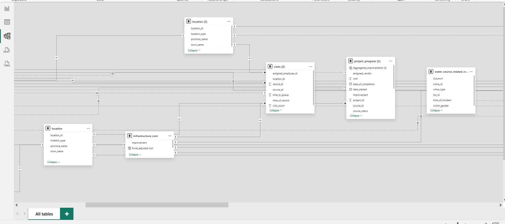
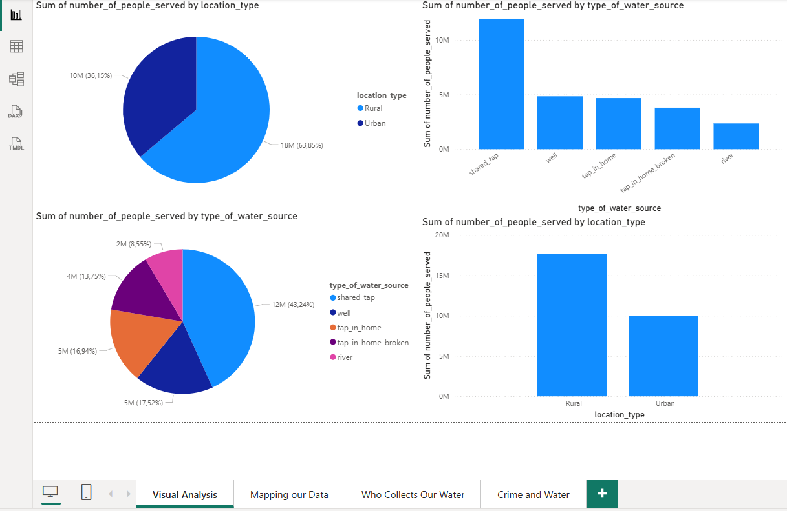
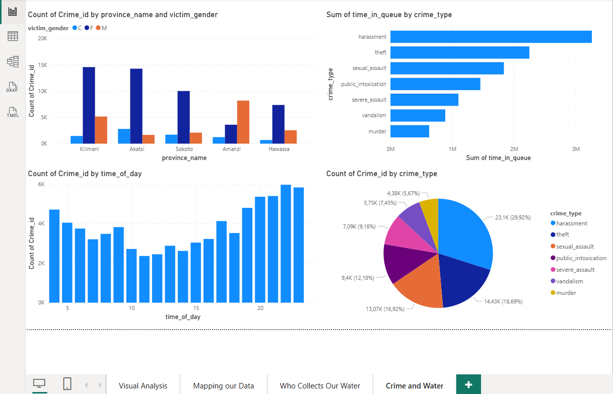
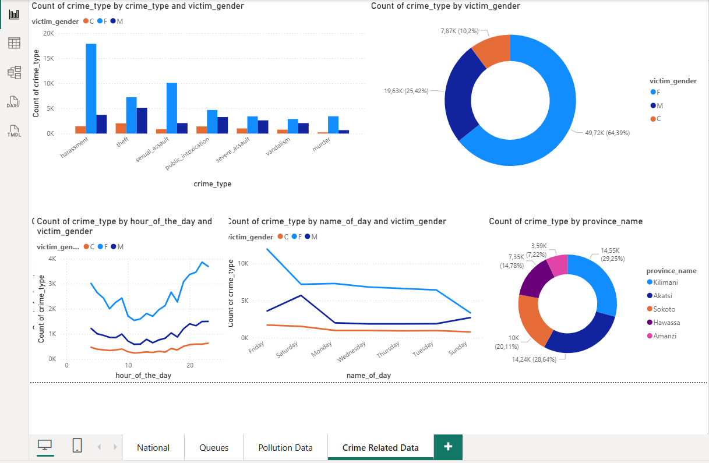
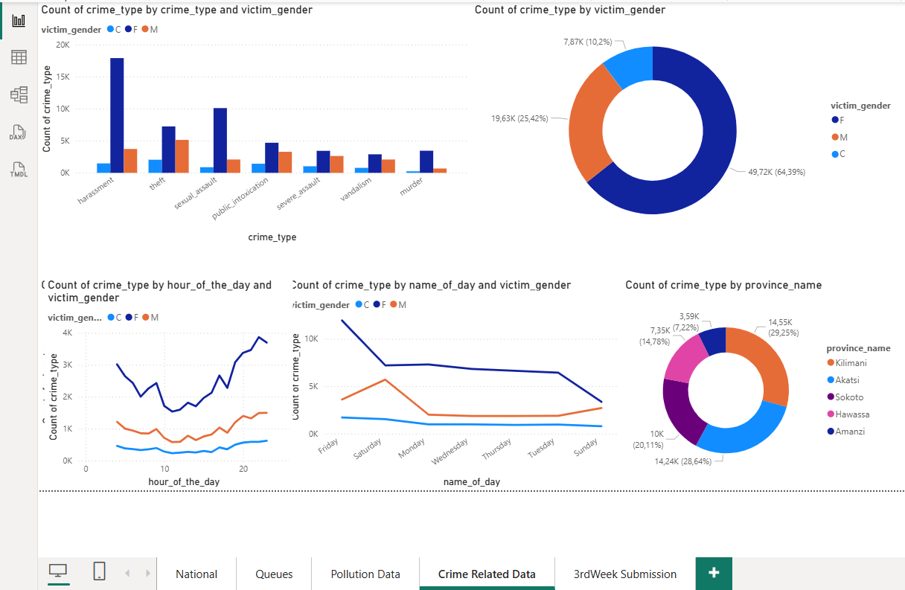
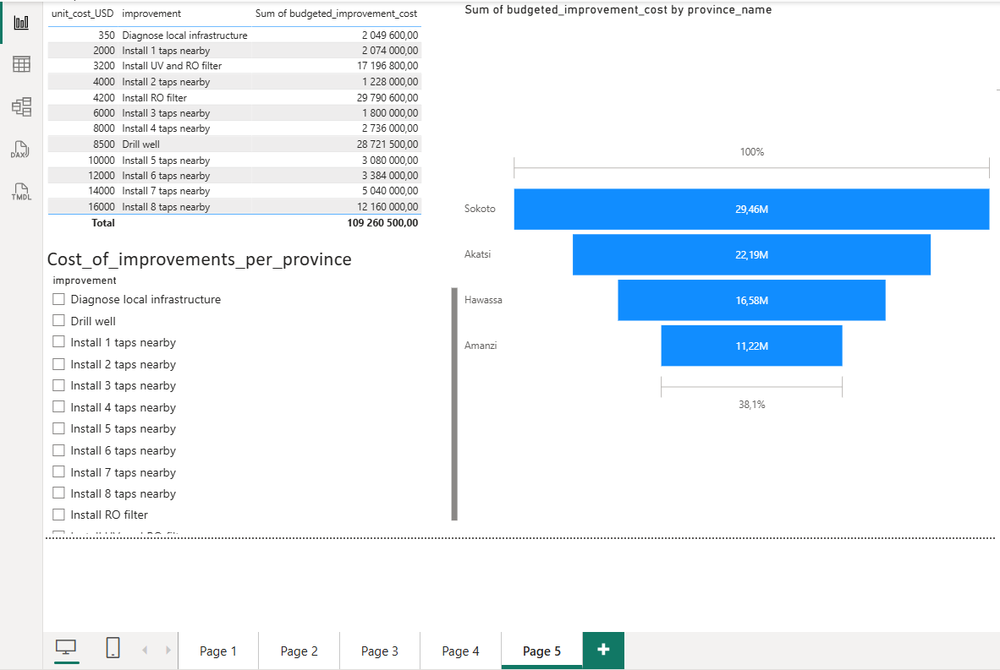
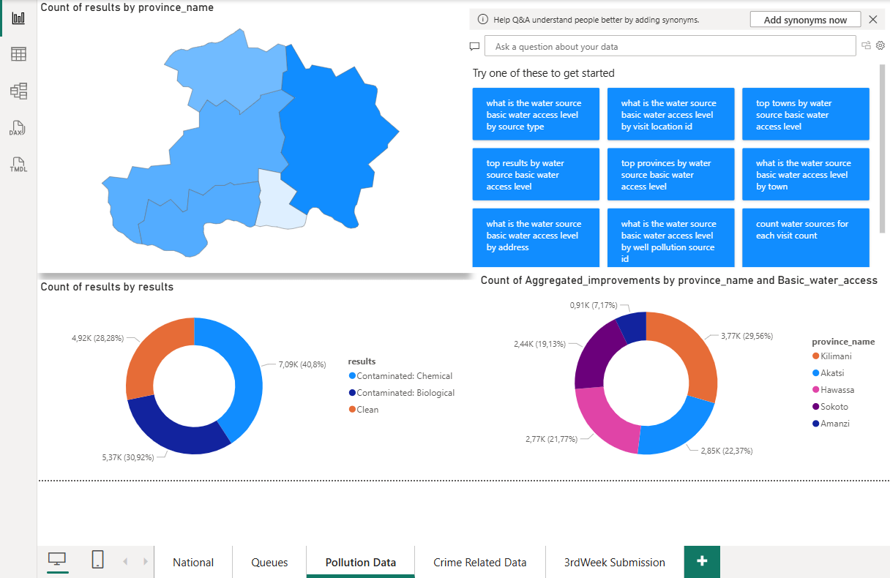

# Maji Ndogo Part 3: Visualizing the Data
## Business Intelligence &  Reporting

### 🎯 Project Overview
In the final phase of the Maji Ndogo project, I transitioned from SQL-based auditing to **Data Storytelling**. This Power BI suite was designed as a "Command Center" turning 60000+ records into an interactive roadmap for national infrastructure development.

### 🛠️ Technical Stack
* **Tool:** Microsoft Power BI
* **Data Modeling:** Schema (Relational Mapping of 5+ tables)
* **Intelligence:** DAX (Dynamic Measures), Power Query and Geospatial Mapping.

---

### ⚙️ System Architecture & Modeling
Before visualizing the data, I established a robust data model to ensure "Single Source of Truth" integrity across all dashboards.

#### **Entity Relationship Diagram (ERD)**

> **Note:** The schema connects geographic locations, water source types and field visit logs. By maintaining a normalized structure, the dashboard can drill down from a national level to a specific street address without performance lag.

---

### 📊 Dashboard 1: National Infrastructure & Access
Strategic overview of water distribution networks and population coverage

  
  

* **System Capacity:** Analyzed access for a total population of 27.6+ Million, mapping the distribution across five primary water source types. This high-level view identifies the "Shared Tap" as the backbone of the current infrastructure, serving the majority of the population but introducing significant system bottlenecks.
* **Geospatial Bottlenecks:** Integrated Power BI Map visuals to perform a Spatial Needs Assessment. By layering population density over source type, Amanzi and Kilimani were identified as critical priority zones. These regions show the highest concentration of "Unimproved" sources, requiring immediate engineering intervention.
* **Urban-Rural Infrastructure Gap:** Developed a visual comparative analysis revealing that rural sectors are over-indexed on Shared Taps and Wells, while urban centers benefit from "Tap in Home" systems. This disparity highlights a systemic failure in rural last-mile delivery, necessitating a shift toward decentralized water purification systems in remote areas.
---

### 📈 Dashboard 2: Social Impact (Gender & Safety)
Analysis of demographic burdens and the correlation between infrastructure efficiency and public safety.

  <!-- Ensure total width does not exceed 100% of the README container width -->
  
  

 

<!-- One image below, centered -->

  <!-- Use 800px width for the bottom image -->

* **Gendered Labor Disparity:** Quantitative analysis reveals a significant Gender Gap in water procurement. Women and girls account for over 65% of all water collection trips particularly in rural regions. This insight highlights a secondary socio-economic crisis: the loss of "educational and economic hours" for female citizens which directly impacts the nation's long-term human capital development.
* **Safety Analytics (Queue vs. Crime):** By cross-referencing historical crime records with water source locations a clear correlation was identified between queue times exceeding 60 minutes and an increase in violent incidents. This data suggests that infrastructure bottlenecks are not just operational failures but major contributors to public insecurity.
* **Temporal Risk Mapping:** The dashboard identifies "High-Risk Windows" (early morning and late evening hours) when water collection is most dangerous. By visualizing these spikes the report provides a mandate for localized security interventions and the prioritization of lighting/surveillance in high-traffic shared-tap zones.
* **Social ROI of Infrastructure:** This analysis shifts the project’s goal from simple "Water Access" to "Social Protection." Reducing queue times through decentralized taps is shown to have a direct positive impact on reducing crime rates effectively turning infrastructure investment into a primary tool for social stability and gender equity.
---

### 💰 Dashboard 3: Operational Budget & Project Progress
Financial oversight and lifecycle tracking of the 25398 national water infrastructure interventions.

* **Capital Expenditure (CAPEX) Optimization:** Developed a dynamic budget tracking system for a multi-million dollar fund. By categorizing costs by intervention type (e.g., UV Filters, Well Drilling, Tap Repairs) the dashboard identifies that 60% of the total budget is allocated to high-impact rural projects, ensuring that capital is deployed where the infrastructure deficit is most acute.
* **Agile Project Lifecycle Tracking:** The dashboard functions as a Real-Time Work-Order System monitoring the status of 25398 specific interventions. By visualizing the transition from "Backlog" to "Complete" the system provides instant visibility into project velocity and identifies provincial bottlenecks where work is stalling.
* **Infrastructural ROI & Efficiency:** Using custom DAX measures I performed an Efficiency Audit which proved that repairing existing "Broken Taps" and "Pipes" serves 3x more people per dollar than new well construction. This data-driven insight allows for a "Repair First" strategy, maximizing the utility of every taxpayer dollar spent.

---

### 💰 Dashboard 4: Pollution and Environmental Impact
Quantitative analysis of water quality metrics and the strategic deployment of filtration technologies.

* **Chemical vs. Biological Contamination Profiling:** Performed a rigorous breakdown of pollutants across all 60000 sources. By isolating Biological contaminants (E. coli/pathogens) from Chemical pollutants, the dashboard allows for the specific allocation of Reverse Osmosis (RO) systems vs. UV Filtration units, ensuring the engineering solution matches the specific environmental hazard.
* Long-term Groundwater Sustainability:** The dashboard serves as a baseline for environmental monitoring. By tracking the success of remediation (moving sources from "Polluted" to "Clean"), we can measure the effectiveness of the national water purification strategy over time, providing a clear data trail for international environmental auditors and health organizations.

---

### 🧠 Key DAX Implementation
he logic engine driving the system's automated insights:

* **Average Queue Benchmark:** Flags any source exceeding the 30-minute UN SDG 6 standard.
* **Dynamic Population Reach:** Calculates the total unique citizens impacted per intervention for "What-If" analysis.
* **Weighted Improvement Cost:** Maps the Improvement_Plan logic (from SQL) to localized budget requirements.

### 🏁 Final Conclusion
This project represents a complete data-driven solution. By applying systems thinking to the Maji Ndogo water crisis, I have bridged the gap between raw records and human impact, creating a blueprint for how data can optimize resources, eliminate corruption and improve the quality of life for an entire nation.

---
*Aspiring Professional Engineer | Data Analyst | ALX Africa Data Analytics Project*
